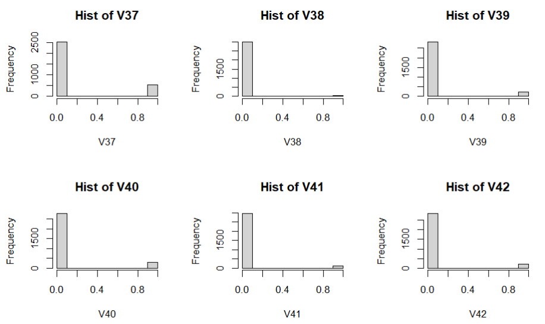

### MATH 189 Final Project

```r
> library(ISLR)
> library(MASS)

> train <- read.table("C:\\Users\\dell\\Downloads\\spam-train.txt", sep = ',')
> test <- read.table("C:\\Users\\dell\\Downloads\\spam-test.txt", sep = ',')
> train_std <- cbind(scale(train[,1:57]),train[,58])
> test_std <- cbind(scale(test[,1:57]),test[,58])
> train_log <- cbind(log(train[,1:57] + 1),train[,58])
> test_log <- cbind(log(test[,1:57] + 1),test[,58])
> train_disc <- as.data.frame(lapply(train[,1:58], function(x) as.integer(x > 0)))
> test_disc <- as.data.frame(lapply(test[,1:58], function(x) as.integer(x > 0)))
```

#### Part (a)

```r
> vis_plots <- function(data){
+   # Correlation matrix of the data
+   cor <- cor(data)
+   indices <- matrix(NA, ncol = 2, nrow = ncol(cor)*(ncol(cor)-1)/2)
+   count <- 0
+   for (i in 1:(ncol(cor)-1)) {
+     for (j in (i+1):ncol(cor)) {
+       if (cor[i, j] > 0.8 && cor[i, j] < 1) {
+        # If the correlation is between 0.8 and 1, store the indices
+        count <- count + 1
+        indices[count, ] <- c(i, j)
+       }
+     }
+   }
+   # Clear out the NA indices
+   indices <- na.omit(indices)
+ 
+   par(mfrow = c(2,3))
+   for (i in 1:length(indices[,1])) {
+     plot(x=data[,indices[i,1]], y=data[,indices[i,2]], xlab=paste("Feature", indices[i,1]), ylab=paste("Feature", indices[i,2]),pch=20); text(x=10,y=10,paste("coef=", round(cor[indices[i,1],indices[i,2]],3)))
+   }
+ }
> vis_plots(train_std)
```


```r
> vis_plots(test_std)
```


```r
> vis_plots(train_log)
```


```r
> vis_plots(test_log)
```


```r
> par(mfrow = c(2,3))
> for (i in 1:57) {
+   hist(train_disc[,i], main = paste0("Hist of V", i), xlab = paste0("V",i))
+ }
```





#### Part (b)

```r
# Standardized
> train_std_df <- as.data.frame(train_std)
> test_std_df <- as.data.frame(test_std)
> 
> model_std <- glm(V58 ~., train_std_df, family = "binomial")
> 
> summary(model_std)

Call:
glm(formula = V58 ~ ., family = "binomial", data = train_std_df)

Deviance Residuals: 
    Min       1Q   Median       3Q      Max  
-4.3245  -0.1988  -0.0001   0.0940   3.6053  

Coefficients:
             Estimate Std. Error z value Pr(>|z|)    
(Intercept)  -7.36294    1.76165  -4.180 2.92e-05 ***
V1           -0.07047    0.08544  -0.825 0.409508    
V2           -0.21268    0.13656  -1.557 0.119379    
V3            0.02573    0.07472   0.344 0.730612    
V4            5.42487    2.63430   2.059 0.039464 *  
V5            0.41029    0.08897   4.611 4.00e-06 ***
V6            0.08488    0.05780   1.469 0.141965    
V7            1.30763    0.19827   6.595 4.24e-11 ***
V8            0.20112    0.07309   2.752 0.005931 ** 
V9            0.21642    0.10039   2.156 0.031095 *  
V10           0.05737    0.06090   0.942 0.346145    
V11          -0.19561    0.07523  -2.600 0.009319 ** 
V12          -0.03552    0.07302  -0.486 0.626655    
V13          -0.13217    0.11069  -1.194 0.232431    
V14          -0.00339    0.06296  -0.054 0.957058    
V15           0.31084    0.23239   1.338 0.181023    
V16           1.10038    0.16449   6.690 2.24e-11 ***
V17           0.59641    0.13999   4.260 2.04e-05 ***
V18          -0.02993    0.08391  -0.357 0.721327    
V19           0.15357    0.07781   1.974 0.048423 *  
V20           1.80199    0.50899   3.540 0.000400 ***
V21           0.49973    0.08500   5.879 4.13e-09 ***
V22           0.10473    0.15871   0.660 0.509332    
V23           1.17267    0.24101   4.866 1.14e-06 ***
V24           0.09945    0.06169   1.612 0.106930    
V25          -3.27164    0.58150  -5.626 1.84e-08 ***
V26          -0.44855    0.39100  -1.147 0.251312    
V27         -18.55268    3.80185  -4.880 1.06e-06 ***
V28           0.24526    0.17081   1.436 0.151031    
V29          -2.42887    1.66214  -1.461 0.143936    
V30           0.01145    0.09666   0.118 0.905705    
V31          -0.08296    0.25709  -0.323 0.746941    
V32          -0.37441    0.95348  -0.393 0.694553    
V33          -0.46280    0.24665  -1.876 0.060610 .  
V34           0.85386    1.01167   0.844 0.398662    
V35          -0.61202    0.35339  -1.732 0.083302 .  
V36           0.07618    0.16958   0.449 0.653264    
V37          -0.26049    0.14890  -1.749 0.080214 .  
V38          -0.15147    0.12133  -1.248 0.211871    
V39          -0.02633    0.15297  -0.172 0.863349    
V40          -0.15745    0.17675  -0.891 0.373028    
V41         -18.56408   12.22870  -1.518 0.128996    
V42          -1.69535    0.58310  -2.907 0.003644 ** 
V43          -0.45417    0.23919  -1.899 0.057599 .  
V44          -0.73394    0.35711  -2.055 0.039857 *  
V45          -0.88579    0.17727  -4.997 5.83e-07 ***
V46          -1.08493    0.25513  -4.252 2.11e-05 ***
V47          -0.64235    0.32519  -1.975 0.048234 *  
V48          -0.50262    0.38329  -1.311 0.189745    
V49          -0.20714    0.10111  -2.049 0.040502 *  
V50           0.04754    0.06007   0.791 0.428765    
V51          -0.06586    0.12898  -0.511 0.609646    
V52           0.24800    0.05813   4.266 1.99e-05 ***
V53           1.01664    0.16220   6.268 3.66e-10 ***
V54           0.59058    0.33572   1.759 0.078551 .  
V55          -0.56200    0.22976  -2.446 0.014445 *  
V56           1.08271    0.29373   3.686 0.000228 ***
V57           0.61655    0.14118   4.367 1.26e-05 ***
---
Signif. codes:  0 ‘***’ 0.001 ‘**’ 0.01 ‘*’ 0.05 ‘.’ 0.1 ‘ ’ 1

(Dispersion parameter for binomial family taken to be 1)

    Null deviance: 4121.0  on 3066  degrees of freedom
Residual deviance: 1157.4  on 3009  degrees of freedom
AIC: 1273.4

Number of Fisher Scoring iterations: 13
> # Predict on training and test sets
> pred_train_std <- predict(model_std, train_std_df, type = "response")
> pred_test_std <- predict(model_std, test_std_df, type = "response")
> 
> # Classification error
> error_train_std_glm <- mean((pred_train_std > 0.5) != train$V58)
> error_test_std_glm <- mean((pred_test_std > 0.5) != test$V58)
> cat("Training error (standardized):", error_train_std_glm, "\n")
Training error (standardized): 0.07173133 
> cat("Test error (standardized):", error_test_std_glm, "\n")
Test error (standardized): 0.07105606

# Log transformation
> names(train_log)[58] <- "V58"
> model_log <- glm(V58 ~., train_log, family = "binomial")
> summary(model_log)

Call:
glm(formula = V58 ~ ., family = "binomial", data = train_log)

Deviance Residuals: 
    Min       1Q   Median       3Q      Max  
-4.0831  -0.1646  -0.0010   0.0738   3.7853  

Coefficients:
             Estimate Std. Error z value Pr(>|z|)    
(Intercept)  -5.55361    0.47536 -11.683  < 2e-16 ***
V1           -0.50525    0.52078  -0.970 0.331955    
V2           -0.48375    0.41287  -1.172 0.241325    
V3           -0.34268    0.32461  -1.056 0.291122    
V4            2.49036    2.49963   0.996 0.319109    
V5            1.68052    0.26735   6.286 3.26e-10 ***
V6            0.49007    0.49976   0.981 0.326779    
V7            3.81919    0.63656   6.000 1.98e-09 ***
V8            1.11891    0.39254   2.850 0.004366 ** 
V9            0.22162    0.61448   0.361 0.718349    
V10           0.20794    0.26664   0.780 0.435466    
V11          -1.73051    0.64790  -2.671 0.007563 ** 
V12          -0.13019    0.21705  -0.600 0.548628    
V13          -1.47819    0.59699  -2.476 0.013284 *  
V14           0.49815    0.49244   1.012 0.311724    
V15           2.35454    1.31509   1.790 0.073389 .  
V16           2.00188    0.30550   6.553 5.64e-11 ***
V17           2.00033    0.49917   4.007 6.14e-05 ***
V18          -0.62599    0.34041  -1.839 0.065927 .  
V19           0.04966    0.17069   0.291 0.771075    
V20           4.74708    1.75988   2.697 0.006989 ** 
V21           0.92793    0.20837   4.453 8.46e-06 ***
V22           0.19783    0.59582   0.332 0.739860    
V23           3.39784    0.89163   3.811 0.000139 ***
V24           1.27695    0.41124   3.105 0.001902 ** 
V25          -3.97126    0.60152  -6.602 4.06e-11 ***
V26          -0.43395    0.74531  -0.582 0.560401    
V27          -5.92242    1.42772  -4.148 3.35e-05 ***
V28           1.27690    0.58913   2.167 0.030202 *  
V29          -5.52545    3.47037  -1.592 0.111344    
V30          -0.08833    0.47636  -0.185 0.852892    
V31          -1.17924    2.44793  -0.482 0.629997    
V32          -4.26131    4.43665  -0.960 0.336814    
V33          -1.44590    0.73243  -1.974 0.048368 *  
V34           0.86735    4.05419   0.214 0.830595    
V35          -2.60252    1.20495  -2.160 0.030784 *  
V36           0.44061    0.70994   0.621 0.534840    
V37          -1.55260    0.59961  -2.589 0.009615 ** 
V38          -1.10219    1.36375  -0.808 0.418971    
V39           0.09940    0.80741   0.123 0.902025    
V40          -1.66152    1.14748  -1.448 0.147622    
V41         -45.30209   35.39198  -1.280 0.200542    
V42          -4.12654    1.24565  -3.313 0.000924 ***
V43          -5.08561    1.94170  -2.619 0.008815 ** 
V44          -2.90440    1.49695  -1.940 0.052354 .  
V45          -2.02986    0.41499  -4.891 1.00e-06 ***
V46          -2.21581    0.52201  -4.245 2.19e-05 ***
V47          -7.41904    4.88356  -1.519 0.128715    
V48          -2.02099    1.39842  -1.445 0.148405    
V49          -1.58851    0.79263  -2.004 0.045059 *  
V50          -0.01172    0.62116  -0.019 0.984945    
V51          -3.40426    2.64864  -1.285 0.198693    
V52           2.24783    0.29972   7.500 6.39e-14 ***
V53           4.93003    0.88667   5.560 2.70e-08 ***
V54          -0.01276    2.13277  -0.006 0.995225    
V55           0.57047    0.33492   1.703 0.088513 .  
V56           0.09317    0.19497   0.478 0.632744    
V57           0.75138    0.13167   5.707 1.15e-08 ***
---
Signif. codes:  0 ‘***’ 0.001 ‘**’ 0.01 ‘*’ 0.05 ‘.’ 0.1 ‘ ’ 1

(Dispersion parameter for binomial family taken to be 1)

    Null deviance: 4121.01  on 3066  degrees of freedom
Residual deviance:  930.67  on 3009  degrees of freedom
AIC: 1046.7

Number of Fisher Scoring iterations: 12
> 
> # Predict on training and test sets
> pred_train_log <- predict(model_log, train_log, type = "response")
> pred_test_log <- predict(model_log, test_log, type = "response")
> 
> # Classification error
> error_train_log_glm <- mean((pred_train_log > 0.5) != train$V58)
> error_test_log_glm <- mean((pred_test_log > 0.5) != test$V58)
> cat("Training error (log transform):", error_train_log_glm, "\n")
Training error (log transform): 0.05771112 
> cat("Test error (log_transform):", error_test_log_glm, "\n")
Test error (log transform): 0.05671447 

# Discretized
> model_disc <- glm(V58 ~., train_disc, family = "binomial")
> summary(model_disc)

Call:
glm(formula = V58 ~ ., family = "binomial", data = train_disc)

Deviance Residuals: 
    Min       1Q   Median       3Q      Max  
-3.6393  -0.1904  -0.0130   0.0600   3.9295  

Coefficients: (3 not defined because of singularities)
             Estimate Std. Error z value Pr(>|z|)    
(Intercept) -2.102414   0.189853 -11.074  < 2e-16 ***
V1          -0.303292   0.289818  -1.046 0.295335    
V2          -0.378470   0.275804  -1.372 0.169989    
V3          -0.199095   0.212662  -0.936 0.349167    
V4           1.096282   0.824259   1.330 0.183511    
V5           1.268090   0.216147   5.867 4.44e-09 ***
V6           0.251840   0.273000   0.922 0.356271    
V7           2.986605   0.386285   7.732 1.06e-14 ***
V8           0.875957   0.316310   2.769 0.005618 ** 
V9           0.228813   0.325213   0.704 0.481695    
V10          0.742343   0.238269   3.116 0.001836 ** 
V11         -1.162239   0.334525  -3.474 0.000512 ***
V12         -0.078381   0.194282  -0.403 0.686624    
V13         -1.161887   0.311432  -3.731 0.000191 ***
V14          0.941421   0.452030   2.083 0.037283 *  
V15          2.006003   0.693342   2.893 0.003813 ** 
V16          1.984579   0.226463   8.763  < 2e-16 ***
V17          1.096497   0.319793   3.429 0.000606 ***
V18         -0.857063   0.264975  -3.235 0.001219 ** 
V19          0.006163   0.224878   0.027 0.978137    
V20          1.670892   0.554536   3.013 0.002586 ** 
V21          0.834548   0.210275   3.969 7.22e-05 ***
V22          0.811703   0.555363   1.462 0.143859    
V23          1.787937   0.392435   4.556 5.21e-06 ***
V24          1.385796   0.343260   4.037 5.41e-05 ***
V25         -3.611845   0.473164  -7.633 2.29e-14 ***
V26         -0.640878   0.497465  -1.288 0.197646    
V27         -4.432733   0.740612  -5.985 2.16e-09 ***
V28          1.981086   0.457457   4.331 1.49e-05 ***
V29         -1.174992   0.668922  -1.757 0.078996 .  
V30         -0.183166   0.519469  -0.353 0.724387    
V31         -1.558298   1.033703  -1.507 0.131685    
V32         -2.211046   1.150863  -1.921 0.054706 .  
V33         -0.926369   0.562091  -1.648 0.099337 .  
V34          0.536636   1.068210   0.502 0.615408    
V35         -0.973451   0.565672  -1.721 0.085273 .  
V36          0.636619   0.417226   1.526 0.127050    
V37         -1.440826   0.348518  -4.134 3.56e-05 ***
V38          1.173486   0.741369   1.583 0.113453    
V39          0.037749   0.413235   0.091 0.927214    
V40         -0.611572   0.557756  -1.096 0.272866    
V41         -5.823151   3.179731  -1.831 0.067051 .  
V42         -2.410825   0.508741  -4.739 2.15e-06 ***
V43         -1.500599   0.638114  -2.352 0.018692 *  
V44         -1.301660   0.521227  -2.497 0.012514 *  
V45         -1.391117   0.235936  -5.896 3.72e-09 ***
V46         -1.789877   0.363562  -4.923 8.52e-07 ***
V47         -0.695873   1.130612  -0.615 0.538235    
V48         -1.512213   0.617515  -2.449 0.014331 *  
V49         -0.070815   0.275485  -0.257 0.797135    
V50          0.185424   0.196176   0.945 0.344561    
V51         -0.056805   0.409948  -0.139 0.889793    
V52          1.476322   0.186253   7.926 2.26e-15 ***
V53          1.858618   0.250030   7.434 1.06e-13 ***
V54         -0.794196   0.338409  -2.347 0.018933 *  
V55                NA         NA      NA       NA    
V56                NA         NA      NA       NA    
V57                NA         NA      NA       NA    
---
Signif. codes:  0 ‘***’ 0.001 ‘**’ 0.01 ‘*’ 0.05 ‘.’ 0.1 ‘ ’ 1

(Dispersion parameter for binomial family taken to be 1)

    Null deviance: 4121.0  on 3066  degrees of freedom
Residual deviance: 1014.6  on 3012  degrees of freedom
AIC: 1124.6

Number of Fisher Scoring iterations: 9
> 
> # Predict on training and test sets
> pred_train_disc <- predict(model_disc, train_disc, type = "response")
> pred_test_disc <- predict(model_disc, test_disc, type = "response")
> 
> # Classification error
> error_train_disc_glm <- mean((pred_train_disc > 0.5) != train$V58)
> error_test_disc_glm <- mean((pred_test_disc > 0.5) != test$V58)
> cat("Training error (discretized):", error_train_disc_glm, "\n")
Training error (discretized): 0.05705902 
> cat("Test error (discretized):", error_test_disc_glm, "\n")
Test error (discretized): 0.08083442 
```

All the features with "$*$"s in the summary are the ones that appear to be statistically significant to the response variable. The training set and the test set errors are reported using the cat function.


#### Part (c)

```r
> train_std_df <- as.data.frame(train_std)
> test_std_df <- as.data.frame(test_std)
> 
> # Linear discriminant analysis on standardized data
> 
> lda_std = lda(V58~.,data = train_std_df)
> 
> lda.pred=predict(lda_std, train_std_df)
> lda.class=lda.pred$class
> true_value=train_std_df$V58
> table(lda.class,true_value)
         true_value
lda.class    0    1
        0 1770  233
        1   79  985
> 
> train_error_std_LDA=mean(lda.class!=true_value)
> train_error_std_LDA
[1] 0.1017281

> lda.pred=predict(lda_std, test_std_df)
> lda.class=lda.pred$class
> true_value=test_std_df$V58
> table(lda.class,true_value)
         true_value
lda.class   0   1
        0 873 115
        1  43 503
> test_error_std_LDA = mean(lda.class!=true_value)
> test_error_std_LDA
[1] 0.1029987

> # Quadratic discriminant analysis on standardized data

> qda_std = qda(V58~.,data = train_std_df)
> 
> qda.pred=predict(qda_std, train_std_df)
> qda.class=qda.pred$class
> table(qda.class,true_value)
         true_value
qda.class    0    1
        0 1369   68
        1  480 1150
>
> train_error_std_QDA=mean(qda.class!=true_value)
> train_error_std_QDA
[1] 0.1786762

> qda_std = qda(V58~.,data = train_std_df)
> 
> qda.pred=predict(qda_std, test_std_df)
> qda.class=qda.pred$class
> table(qda.class,true_value)
         true_value
qda.class   0   1
        0 673  25
        1 243 593
> test_error_std_QDA=mean(qda.class!=true_value)
> test_error_std_QDA
[1] 0.1747066

> names(train_log)[58] <- "V58"
> names(test_log)[58] <- "V58"
> 
> # Linear discriminant analysis on log data
> qda_log = qda(V58~.,data = train_log)
> 
> qda.pred = predict(qda_log, train_log )
> qda.class = qda.pred1$class
> table(qda.class1,true_value)
          true_value
qda.class    0    1
         0 1433   71
         1  416 1147
> 
> train_error_log_QDA=mean(qda.class!=true_value)
> train_error_log_QDA
[1] 0.1587871

> lda_log = lda(V58~.,data = train_log)
> 
> lda.pred = predict(lda_log, test_log)
> lda.class = lda.pred1$class
> true_value = test_log$V58
> table(lda.class,true_value)
          true_value
lda.class   0   1
         0 885  69
         1  31 549
> test_error_log_LDA=mean(lda.class!=true_value)
> test_error_log_LDA
[1] 0.06518905

> # Quadratic discriminant analysis on log data
> qda_log = qda(V58~.,data = train_log)
> 
> qda.pred = predict(qda_log, train_log )
> qda.class = qda.pred1$class
> table(qda.class,true_value)
          true_value
qda.class    0    1
         0 1433   71
         1  416 1147
> 
> train_error_log_QDA=mean(qda.class!=true_value)
> train_error_log_QDA
[1] 0.1587871

> qda_log = qda(V58~.,data = train_log)
> 
> qda.pred = predict(qda_log, test_log )
> qda.class = qda.pred1$class
> table(qda.class,true_value)
          true_value
qda.class   0   1
         0 702  27
         1 214 591
> test_error_log_QDA=mean(qda.class!=true_value)
> test_error_log_QDA
[1] 0.1571056
```

#### Part (d)

```r
> # Train a linear SVM model on the standardized data
> library(e1071)
> set.seed(123)
> x_train <- train_std[,1:57]
> y_train <- train_std[,58]
> x_test <- test_std[,1:57]
> y_test <- test_std[,58]
> 
> train_std_df = data.frame(x=x_train,y=as.factor (y_train))
> test_std_df = data.frame(x=x_test, y=as.factor(y_test))
> 
> tuned_params <- tune(svm,y ~., data = train_std_df, kernel = "linear", ranges = list(cost = c(0.01, 0.1, 1)))
> 
> model_linear <- svm(y ~., data = train_std_df, kernel = "linear",
+                     cost = tuned_params$best.parameters$cost)
> 
> # Predict the target variable for the training and test sets
> y_pred_train <- predict(model_linear, train_std_df)
> y_pred_test <- predict(model_linear, test_std_df)
> 
> # Calculate the classification errors
> train_error_std_linearSVM <- mean(y_pred_train != y_train)
> test_error_std_linearSVM <- mean(y_test != y_pred_test)
> 
> # Print the errors
> cat("Linear SVM training error:", train_error_std_linearSVM, "\n")
Linear SVM training error: 0.06488425 
> cat("Linear SVM test error:", test_error_std_linearSVM, "\n")
Linear SVM test error: 0.07170795

> # Train a non-linear SVM model with RBF kernel and perform hyperparameter tuning with cross-validation
> > tuned_params=tune(svm, y~., data=train_std_df, kernel ="radial", 
+                     ranges=list(cost=seq(0.05, 0.5, length=10),
+                               gamma=c(0.1,0.5,1,2)))
> 
> # Print the optimal hyperparameters and the corresponding cross-validation error
> cat("Optimal cost parameter:", tuned_params$best.parameters$cost, "\n")
Optimal cost parameter: 0.5 
> cat("Optimal gamma parameter:", tuned_params$best.parameters$gamma, "\n")
Optimal gamma parameter: 0.1 
> cat("Cross-validation error:", tuned_params$best.performance, "\n")
Cross-validation error: 0.08509293 
> 
> # Train a non-linear SVM model with the optimal hyperparameters
> model_rbf <- svm(y ~., data = train_std_df, kernel = "radial",
+                  cost = tuned_params$best.parameters$cost, gamma = tuned_params$best.parameters$gamma)
> 
> # Predict the target variable for the training and test sets
> y_train <- train_std_df[,58]
> y_test <- test_std_df[,58]
> y_pred_train <- predict(model_rbf, train_std_df)
> y_pred_test <- predict(model_rbf, test_std_df)
> 
> # Calculate the classification errors
> train_error_std_nonlinearSVM <- mean(y_train != y_pred_train)
> test_error_std_nonlinearSVM <- mean(y_test != y_pred_test)
> 
> # Print the errors
> cat("Non-linear SVM (RBF kernel) training error:", train_error_std_nonlinearSVM, "\n")
Non-linear SVM (RBF kernel) training error: 0.03064884 
> cat("Non-linear SVM (RBF kernel) test error:", test_error_std_nonlinearSVM, "\n")
Non-linear SVM (RBF kernel) test error: 0.07757497

> # Train a linear SVM model on the log transformed data
> x_train <- train_log[,1:57]
> y_train <- train_log[,58]
> x_test <- test_log[,1:57]
> y_test <- test_log[,58]
> 
> train_log_df = data.frame(x=x_train,y=as.factor (y_train))
> test_log_df = data.frame(x=x_test, y=as.factor(y_test))
> 
> tuned_params <- tune(svm,y ~., data = train_log_df, kernel = "linear", ranges = list(cost = c(0.01, 0.1, 1)))
> 
> model_linear <- svm(y ~., data = train_log_df, kernel = "linear",
+                     cost = tuned_params$best.parameters$cost)
> 
> # Predict the target variable for the training and test sets
> y_pred_train <- predict(model_linear, train_log_df)
> y_pred_test <- predict(model_linear, test_log_df)
> 
> # Calculate the classification errors
> train_error_log_linearSVM <- mean(y_pred_train != y_train)
> test_error_log_linearSVM <- mean(y_test != y_pred_test)
> 
> # Print the errors
> cat("Linear SVM training error:", train_error_log_linearSVM, "\n")
Linear SVM training error: 0.05901532 
> cat("Linear SVM test error:", test_error_log_linearSVM, "\n")
Linear SVM test error: 0.05801825 

> # Train a non-linear SVM model with RBF kernel and perform hyperparameter tuning with cross-validation
> tuned_params=tune(svm, y~., data=train_log_df, kernel ="radial", 
+                    ranges=list(cost=seq(0.05, 0.5, length=10),
+                               gamma=c(0.1,0.5,1,2)))
> 
> # Print the optimal hyperparameters and the corresponding cross-validation error
> cat("Optimal cost parameter:", tuned_params$best.parameters$cost, "\n")
Optimal cost parameter: 0.5 
> cat("Optimal gamma parameter:", tuned_params$best.parameters$gamma, "\n")
Optimal gamma parameter: 0.1 
> cat("Cross-validation error:", tuned_params$best.performance, "\n")
Cross-validation error: 0.08965425  
> 
> # Train a non-linear SVM model with the optimal hyperparameters
> model_rbf <- svm(y ~., data = train_log_df, kernel = "radial",
+                  cost = tuned_params$best.parameters$cost, gamma = tuned_params$best.parameters$gamma)
> 
> # Predict the target variable for the training and test sets
> y_train <- train_log_df[,58]
> y_test <- test_log_df[,58]
> y_pred_train <- predict(model_rbf, train_log_df)
> y_pred_test <- predict(model_rbf, test_log_df)
> 
> # Calculate the classification errors
> train_error_log_nonlinearSVM <- mean(y_pred_train != y_train)
> test_error_log_nonlinearSVM <- mean(y_pred_test != y_test)
> 
> # Print the errors
> cat("Non-linear SVM (RBF kernel) training error:", train_error_log_nonlinearSVM, "\n")
Non-linear SVM (RBF kernel) training error: 0.01695468 
> cat("Non-linear SVM (RBF kernel) test error:", test_error_log_nonlinearSVM, "\n")
Non-linear SVM (RBF kernel) test error: 0.06062581

> # Train a linear SVM model on the discretized data
> # Columns 55-57 are constant; they cannot be scaled and we need to remove them
> x_train <- train_disc[,1:54]
> y_train <- train_disc[,58]
> x_test <- test_disc[,1:54]
> y_test <- test_disc[,58]
> 
> train_disc_df = data.frame(x=x_train,y=as.factor (y_train))
> test_disc_df = data.frame(x=x_test, y=as.factor(y_test))
> 
> tuned_params <- tune(svm,y ~., data = train_disc_df, kernel = "linear", ranges = list(cost = c(0.01, 0.1, 1)))
> 
> model_linear <- svm(y ~., data = train_disc_df, kernel = "linear",
+                     cost = tuned_params$best.parameters$cost)
> 
> # Predict the target variable for the training and test sets
> y_pred_train <- predict(model_linear, train_disc_df)
> y_pred_test <- predict(model_linear, test_disc_df)
> 
> # Calculate the classification errors
> train_error_disc_linearSVM <- mean(y_pred_train != y_train)
> test_error_disc_linearSVM <- mean(y_test != y_pred_test)
> 
> # Print the errors
> cat("Linear SVM training error:", train_error_disc_linearSVM, "\n")
Linear SVM training error: 0.05803717 
> cat("Linear SVM test error:", test_error_disc_linearSVM, "\n")
Linear SVM test error: 0.07496741 

> # Train a non-linear SVM model with RBF kernel and perform hyperparameter tuning with cross-validation
> set.seed(123)
> x_train <- train_disc[,1:54]
> y_train <- train_disc[,58]
> x_test <- test_disc[,1:54]
> y_test <- test_disc[,58]
> 
> train_disc_df = data.frame(x=x_train,y=as.factor (y_train))
> test_disc_df = data.frame(x=x_test, y=as.factor(y_test))
> 
> tuned_params=tune(svm, y~., data=train_disc_df, kernel ="radial", 
+                   ranges=list(cost=seq(0.05, 0.5, length=10),
+                                gamma=c(0.1,0.5,1,2)))
> 
> # Print the optimal hyperparameters and the corresponding cross-validation error
> cat("Optimal cost parameter:", tuned_params$best.parameters$cost, "\n")
Optimal cost parameter: 0.5 
> cat("Optimal gamma parameter:", tuned_params$best.parameters$gamma, "\n")
Optimal gamma parameter: 0.1 
> cat("Cross-validation error:", tuned_params$best.performance, "\n")
Cross-validation error: 0.08966384 
> 
> # Train a non-linear SVM model with the optimal hyperparameters
> model_rbf <- svm(y ~., data = train_disc_df, kernel = "radial",
+                  cost = tuned_params$best.parameters$cost, gamma = tuned_params$best.parameters$gamma)
> 
> # Predict the target variable for the training and test sets
> y_train <- train_disc_df[,55]
> y_test <- test_disc_df[,55]
> y_pred_train <- predict(model_rbf, train_disc_df)               
> y_pred_test <- predict(model_rbf, test_disc_df)
> 
> # Calculate the classification errors
> train_error_disc_nonlinearSVM <- mean(y_train != y_pred_train)
> test_error_disc_nonlinearSVM <- mean(y_test != y_pred_test)
> 
> # Print the errors
> cat("Non-linear SVM (RBF kernel) training error:", train_error_disc_nonlinearSVM, "\n")
Non-linear SVM (RBF kernel) training error: 0.0215194 
> cat("Non-linear SVM (RBF kernel) test error:", test_error_disc_nonlinearSVM, "\n")
Non-linear SVM (RBF kernel) test error: 0.08670143  
```

According to the results above, the linear SVM model on both the log transformed data and the discretized data appear to have the lowest error rates. 

#### Part (e)

```r
> library(tree)
> tree_train <- tree(V58~., train)
> cv_train <- cv.tree(tree_train)
> plot(cv_train$size, cv_train$dev, type = "b", xlab = "Size", ylab = "CV MSE", col = "red")
```


```r
> cv.size <- cv_train$size[which.min(cv_train$dev)]
> prune_train <- prune.tree(tree_train, best = cv.size)
> plot(prune_train)
> text(prune_train, pretty = 0)
```


```r
> library(randomForest)
# RandomForest
> rf_error <- function(data){
+   label <- data[,ncol(data)]
+   rf <- randomForest(label~., data, mtry = 10, importance = TRUE, ntree = 100)
+   pred <- predict(rf, data)
+   direction <- ifelse(pred > 0.99, 1, 0)
+   confusion <- table(direction, label)
+   error <- sum(direction != label) / sum(confusion)
+   print(error)
+ }
> train_std_rf <- rf_error(train_std)
[1] 0.1121617
> train_log_rf <- rf_error(train_log)
[1] 0.09781545
> train_disc_rf <- rf_error(train_disc)
[1] 0.07955657
> test_std_rf <- rf_error(test_std)
[1] 0.1662321
> test_log_rf <- rf_error(test_log)
[1] 0.1473272
> test_disc_rf <- rf_error(test_disc)
[1] 0.1408083

# Bagging
> bag_error <- function(data){
+   label <- data[,ncol(data)]
+   rf <- randomForest(label~., data, mtry = ncol(data)-1, importance = TRUE, ntree = 100)
+   pred <- predict(rf, data)
+   direction <- ifelse(pred > 0.99, 1, 0)
+   confusion <- table(direction, label)
+   error <- sum(direction != label) / sum(confusion)
+   print(error)
+ }
> train_std_bag <- bag_error(train_std)
[1] 0.0218454515813499
> train_log_bag <- bag_error(train_log)
[1] 0.026084121291164
> train_disc_bag <- bag_error(train_disc)
[1] 0
> test_std_bag <- bag_error(test_std)
[1] 0.002607562
> test_log_bag <- bag_error(test_log)
[1] 0.007822686
> test_disc_bag <- bag_error(test_disc)
[1] 0
```

### Table for all results

```r
> trainErrorTable = matrix(0, ncol = 3, nrow = 7)
> colnames(trainErrorTable) = c('standardized', 'log-transformed', 'discretized')
> rownames(trainErrorTable) = c('logistic regression model', 'LDA', 'QDA',
+                              'linear SVM', 'nonlinear SVM', 'random forest', 'bagging')
> trainErrorTable[1,1] = error_train_std_glm
> trainErrorTable[1,2] = error_train_log_glm
> trainErrorTable[1,3] = error_train_disc_glm
> trainErrorTable[2,1] = train_error_std_LDA
> trainErrorTable[3,1] = train_error_std_QDA
> trainErrorTable[2,2] = train_error_log_LDA
> trainErrorTable[2,3] = 'NA'
> trainErrorTable[3,2] = train_error_log_QDA
> trainErrorTable[3,3] = 'NA'
> trainErrorTable[4,1] = train_error_std_linearSVM
> trainErrorTable[4,2] = train_error_log_linearSVM
> trainErrorTable[4,3] = train_error_disc_linearSVM
> trainErrorTable[5,1] = train_error_std_nonlinearSVM
> trainErrorTable[5,2] = train_error_log_nonlinearSVM
> trainErrorTable[5,3] = train_error_disc_nonlinearSVM
> trainErrorTable[6,1] = train_std_rf
> trainErrorTable[6,2] = train_log_rf
> trainErrorTable[6,3] = train_disc_rf
> trainErrorTable[7,1] = train_std_bag
> trainErrorTable[7,2] = train_log_bag
> trainErrorTable[7,3] = train_disc_bag
> 
> print(trainErrorTable)
                          standardized         log-transformed      discretized         
logistic regression model "0.071731333550701"  "0.0577111183567004" "0.0570590153244213"
LDA                       "0.10172807303554"   "0.0603195304858168" "NA"                
QDA                       "0.178676230844473"  "0.158787088359961"  "NA"                
linear SVM                "0.0648842517117705" "0.0590153244212586" "0.0580371698728399"
nonlinear SVM             "0.03064884"         "0.01695468 "        "0.0215194"
random forest             "0.104010433648516"  "0.106944897293772"  "0.0906423214867949"
bagging                   "0.0218454515813499" "0.026084121291164"  "0"   

> testErrorTable = matrix(0, ncol = 3, nrow = 7)
> colnames(testErrorTable) = c('standardized', 'log-transformed', 'discretized')
> rownames(testErrorTable) = c('logistic regression model', 'LDA', 'QDA',
+                              'linear SVM', 'nonlinear SVM', 'random forest', 'bagging')
> testErrorTable[1,1] = error_test_std_glm
> testErrorTable[1,2] = error_test_log_glm
> testErrorTable[1,3] = error_test_disc_glm
> testErrorTable[2,1] = train_error_std_LDA
> testErrorTable[3,1] = train_error_std_QDA
> testErrorTable[2,2] = train_error1_log_LDA
> testErrorTable[2,3] = 'NA'
> testErrorTable[3,2] = train_error1_log_QDA
> testErrorTable[3,3] = 'NA'
> testErrorTable[4,1] = test_error_std_linearSVM
> testErrorTable[4,2] = test_error_log_linearSVM
> testErrorTable[4,3] = test_error_disc_linearSVM
> testErrorTable[5,1] = test_error_std_nonlinearSVM
> testErrorTable[5,2] = test_error_log_nonlinearSVM
> testErrorTable[5,3] = test_error_disc_nonlinearSVM
> testErrorTable[6,1] = test_std_rf
> testErrorTable[6,2] = test_log_rf
> testErrorTable[6,3] = test_disc_rf
> testErrorTable[7,1] = test_std_bag
> testErrorTable[7,2] = test_log_bag
> testErrorTable[7,3] = test_disc_bag
> print(testErrorTable)
                          standardized         log-transformed       discretized         
logistic regression model "0.0710560625814863" "0.0567144719687093"  "0.0808344198174707"
LDA                       "0.10172807303554"   "0.0603195304858168"  "NA"                
QDA                       "0.178676230844473"  "0.158787088359961"   "NA"                
linear SVM                "0.0717079530638853" "0.0580182529335072"  "0.0749674054758801"
nonlinear SVM             "0.07757497"         "0.06062581"          "0.08670143"
random forest             "0.158409387222947"  "0.155149934810952"   "0.13754889178618"  
bagging                   "0.002607562"        "0.007822686"         "0"    

```

According to the, the bagging classifier has significantly lower error rate than any other methods, this might be happening accompanying with over-fitting effects, so the linear SVM and the logistic regression model are seemingly better amongst these methods.

#### Decision Tree Model

```r
> library(rpart)
> dt <- function(data){
+   # Split data into features and labels 
+   X_train <- data[,1:ncol(data)-1] 
+   y_train <- data[,ncol(data)] 
+   X_test <- data[,1:ncol(data)-1] 
+   y_test <- data[,ncol(data)] 
+   
+   # Build decision tree model 
+   dt_model <- rpart(y_train ~ ., data = X_train, method = "class") 
+   
+   # Predict on training data 
+   train_preds <- predict(dt_model, X_train, type = "class")
+   # Calculate training error 
+   train_error <- mean(train_preds != y_train) 
+   cat("Training error:", train_error, "\n") 
+   
+   # Predict on test data 
+   test_preds <- predict(dt_model, X_test, type = "class") 
+   test_error <- mean(test_preds != y_test) > cat("Test error:", test_error, "\n")
+ }
> dt_std <- dt(train_std_df)
Training error: 0.09325073 
Test error: 0.09256845 
> dt_log <- dt(train_log_df)
Training error: 0.09325073 
Test error: 0.09256845 
> dt_disc <- dt(train_disc_df)
Training error: 0.09846756 
Test error: 0.09256845 
```


#### Contribution

All three of the group members worked together throughout the project.